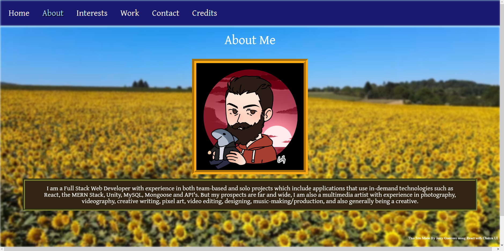
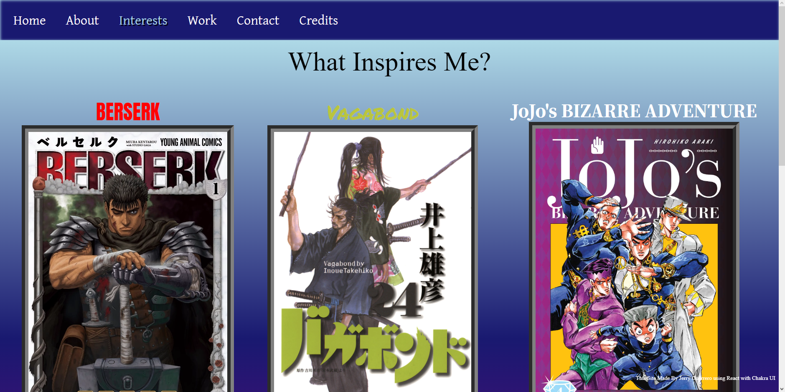
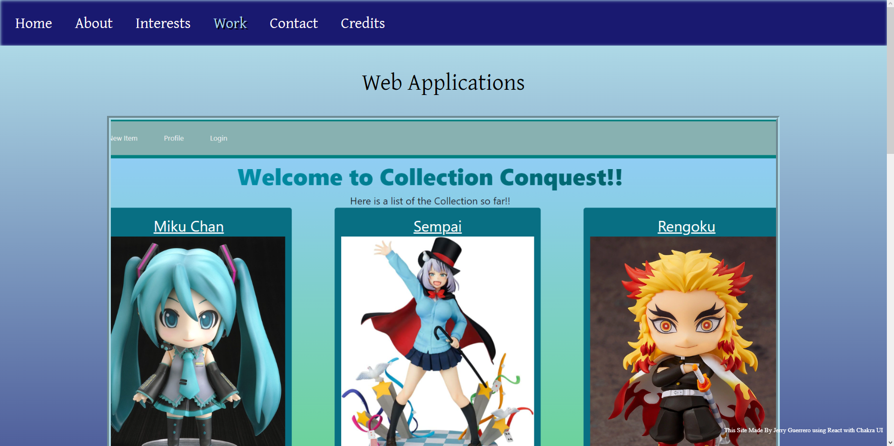

# A-Probable-Reaction

This is my portfolio remade using React.

## Table of Contents

- [Tech](#tech)
- [Installation](#installation)
- [Usage](#usage)
- [Contributing](#contributing)
- [Questions](#questions)
- [License](#license)

## Tech

---

The following technology was used in this project: REACT, CSS, JAVASCRIPT, EXPRESS, NODE and HEROKU

## Installation

---

Being that this is a web application, there is no install necessary!

## Usage

---

In order to use this app, you simply need to go to the website and look around on it! Super easy!

## Contributing

---

This project is not accepting any contributions at this time.

## Images

---

## Questions

---

For any questions you can reach out to me at the following:

Email: JerryGDev126@gmail.com

GitHub: https://github.com/JGuerrero126

## License

---

This project is protected under the Apache license and all relevant protections are granted.
